# Labpy05
## Penjelasan :
Modul praktikum yang ke 5 ini berisi tentang latihan menggunakan dictionary pada python,
dan juga praktikum membuat Program Daftar Nilai Mahasiswa menggunakan dictionary dan menampilkan pilihan-pilihan menu nya menu antara lain seperti: Ubah, Tambah, Hapus, cari dan lihat.

### LATIHAN
Dan ini adalah latihan nya

Latihan yang pertama adalah membuat daftar kontak dengan menggunakan dictionary pada python

berikut adalah tampilannya :
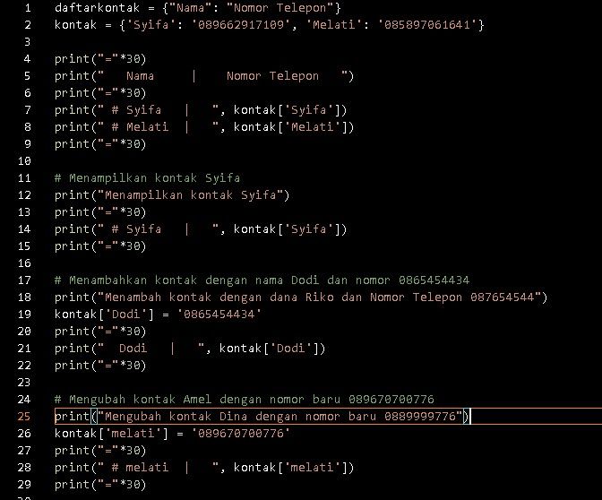
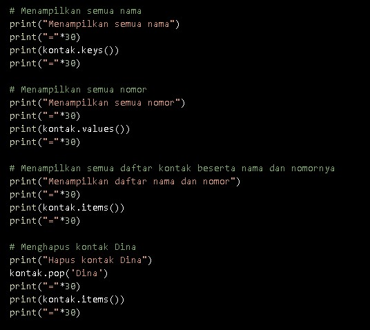

### penjelasannya adalah 

Dibawah ini adalah untuk menampung data dari dictionary
daftarkontak = {"Nama":"Nomor Telepon"}
kontak = {'Syifa': '089662917109', 'Melati': '085897061641'}
Sedangkan code dibawah adalah untuk mengakses atau menampilkan kontak yang telah ditampung dalam data dictionary tersebut
print("="*30)
print("   Nama     |    Nomor Telepon   ")
print("="*30)
print(" # Syifa   |   ", kontak['Syifa'])
print(" # Melati  |   ", kontak['Melati'])
print("="*30)

Dan ini adalah hasil dari programnya :

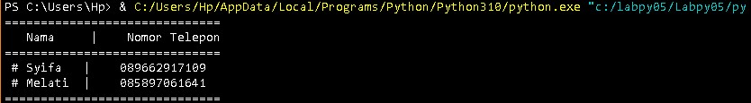

Code dibawah ini adalah untuk menampilkan salah satu dari daftar kontak yang ada, dibawah yang akan di tampilkan adalah daftar kontak Syifa
Menampilkan kontak Syifa
print("Menampilkan kontak Syifa")
print("="*30)
print(" # Syifa   |   ", kontak['Syifa'])
print("="*30)

Berikut ini adalah hasil programnya:

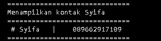

Code dibawah ini untuk menambahkan kontak dengan nama Dodi dan nomor 0865454434
print("Menambah kontak dengan dana Riko dan Nomor Telepon 087654544")
kontak['Dodi'] = '0865454434'
print("="*30)
print("  Dodi   |   ", kontak['Dodi'])
print("="*30)

Berikut ini hasil dari programya : 

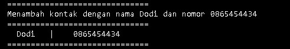

Code dibawah untuk mengubah kontak Amel dengan nomor baru 089670700776
print("Mengubah kontak Amel dengan nomor baru 089670700776 ")
kontak['Amel'] = '089670700776'
print("="*30)
print(" # Amel  |   ", kontak['Amel'])
print("="*30)

Berikut ini hasil dari programya : 

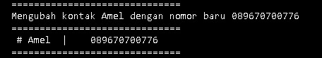

Code dibawah untuk menampilkan semua nama yang ada dalam daftar kontak
print("Menampilkan semua nama")
print("="*30)
print(kontak.keys())
print("="*30)

Berikut ini hasil dari programya : 

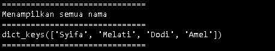

Code berikut untuk menampilkan semua nomor yang ada dalam daftar kontak
print("Menampilkan semua nomor")
print("="*30)
print(kontak.values())
print("="*30)

Berikut ini hasil dari programya : 

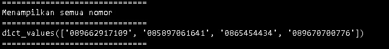

code di bawah ini untuk Menampilkan semua daftar kontak beserta nama dan nomornya
print("Menampilkan daftar nama dan nomor")
print("="*30)
print(kontak.items())
print("="*30)

Berikut ini hasil dari programya :

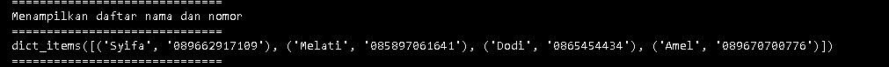

Code dibawah untuk menghapus kontak Amel yang tersimpan dalam daftar kontak
 Menghapus kontak Amel
print("Hapus kontak Amel")
kontak.pop('Amel')
print("="*30)
print(kontak.items())
print("="*30)

Berikut ini hasil dari programya :

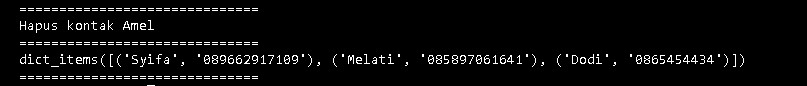

### PRAKTIKUM
Dibawah ini adalah program sederhana untuk membuat daftar nilai mahasiswa dengan menggunakan dictionary, dan menampilkan pilihan menu tambah, ubah, cari, hapus, dan lihat.

Dan ini adalah tampilannya :
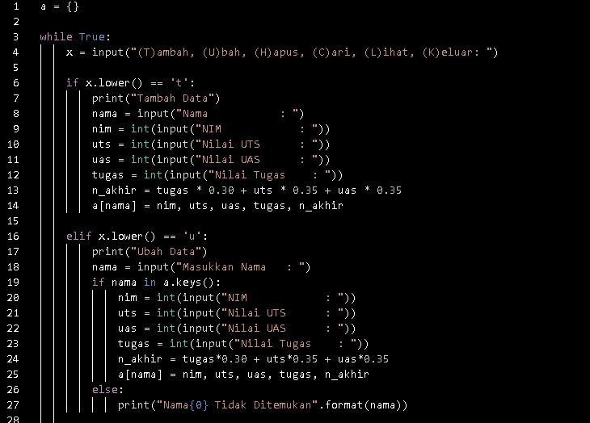
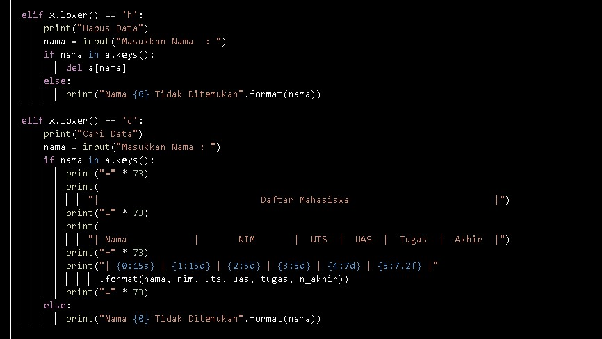
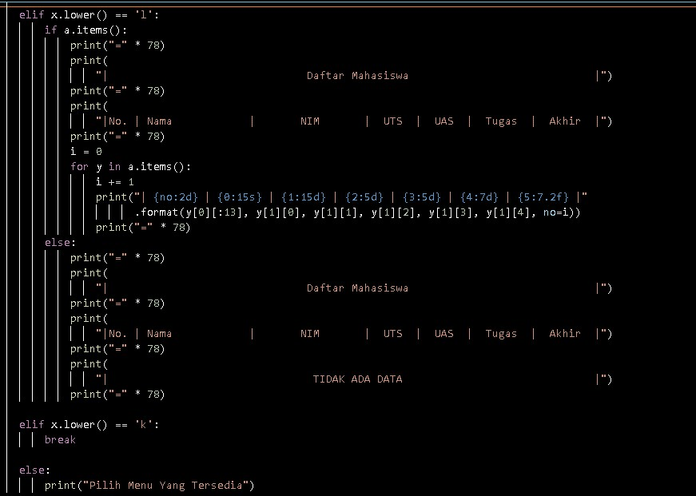

Dan ini adalah tampilan dari flowchart nya :

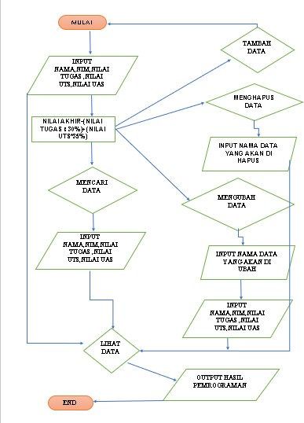

Dengan penjelasan source code sebagai berikut:

Code dibawah ini untuk membuat dictionary kosong, untuk menampung dictionary dengan menggunakan tuple

a = {}

Code dibawah ini untuk perulangan while, dan juga untuk menginisialkan penambahan menu pilihan Tambah, Ubah, Hapus, Cari, Lihat dan Keluar:
while True:

    x = input("(T)ambah, (U)bah, (H)apus, (C)ari, (L)ihat, (K)eluar: ")

Code dibawah adalah untuk syntax penambahan data, dengan ketentuan jika kita mengetikkan 't' pada keyboard, maka akan melakukan penambahan data dan ditampung kedalam dictionary 'a' yang telah kita buat, dengan nama sebagai keys, dan yang lainnya sebagai values

    if x.lower() == 't':
        print("Tambah Data")
        nama = input("Nama           : ")
        nim = int(input("NIM            : "))
        uts = int(input("Nilai UTS      : "))
        uas = int(input("Nilai UAS      : "))
        tugas = int(input("Nilai Tugas    : "))
        n_akhir = tugas * 0.30 + uts * 0.35 + uas * 0.35
        a[nama] = nim, uts, uas, tugas, n_akhir

Code dibawah adalah untuk syntax mengubah data, dengan ketentuan jika kita mengetikkan 'u' pada keyboard, maka akan melakukan perubahan data yang telah di tampung ke dalam dictionary 'a' yang telah kita buat, tetapi data yang dapat diubah hanya data yang berupa values nya saja

    elif x.lower() == 'u':
        print("Ubah Data")
        nama = input("Masukkan Nama   : ")
        if nama in a.keys():
            nim = int(input("NIM            : "))
            uts = int(input("Nilai UTS      : "))
            uas = int(input("Nilai UAS      : "))
            tugas = int(input("Nilai Tugas    : "))
            n_akhir = tugas*0.30 + uts*0.35 + uas*0.35
            a[nama] = nim, uts, uas, tugas, n_akhir
        else:
            print("Nama{0} Tidak Ditemukan".format(nama))

Code dibawah adalah untuk syntax penghapusan data, dengan ketentuan jika kita mengetikkan 'h' pada keyboard, maka akan melakukan penghapusan data yang telah kita masukkan kedalam dictionary 'a' yang telah kita buat dengan statemen del a[nama]

    elif x.lower() == 'h':
        print("Hapus Data")
        nama = input("Masukkan Nama  : ")
        if nama in a.keys():
            del a[nama]
        else:
            print("Nama {0} Tidak Ditemukan".format(nama))

Code dibawah adalah untuk syntax pencarian data, dengan ketentuan jika kita mengetikkan 'c' pada keyboard, maka akan melakukan pencarian data dengan memasukkan keys dari data yang telah kita masukkan kedalam dictionary 'a' yang telah kita buat

    elif x.lower() == 'c':
        print("Cari Data")
        nama = input("Masukkan Nama : ")
        if nama in a.keys():
            print("=" * 73)
            print("|                             Daftar Mahasiswa                          |")
            print("=" * 73)
            print("| Nama            |       NIM       |  UTS  |  UAS  |  Tugas  |  Akhir  |")
            print("=" * 73)
            print("| {0:15s} | {1:15d} | {2:5d} | {3:5d} | {4:7d} | {5:7.2f} |"
                  .format(nama, nim, uts, uas, tugas, n_akhir))
            print("=" * 73)
        else:
            print("Nama {0} Tidak Ditemukan".format(nama))

Code dibawah adalah untuk syntax melihat data, dengan ketentuan jika kita mengetikkan 'l' pada keyboard, maka akan menampilkan keseluruhan dari data yang telah kita masukkan dan ditampung ke dalam dictionary 'a' yang telah kita buat

    elif x.lower() == 'l':
        if a.items():
            print("=" * 78)
            print("|                               Daftar Mahasiswa                             |")
            print("=" * 78)
            print("|No. | Nama            |       NIM       |  UTS  |  UAS  |  Tugas  |  Akhir  |")
            print("=" * 78)
            i = 0
            for y in a.items():
                i += 1
                print("| {no:2d} | {0:15s} | {1:15d} | {2:5d} | {3:5d} | {4:7d} | {5:7.2f} |"
                      .format(y[0][:13], y[1][0], y[1][1], y[1][2], y[1][3], y[1][4], no=i))
                print("=" * 78)

Code dibawah adalah untuk menampilkan 'TIDAK ADA DATA', jika kita belum pernah memasukkan data kedalam dictionary 'a'
        else:
            print("=" * 78)
            print("|                               Daftar Mahasiswa                             |")
            print("=" * 78)
            print("|No. | Nama            |       NIM       |  UTS  |  UAS  |  Tugas  |  Akhir  |")
            print("=" * 78)
            print("|                                TIDAK ADA DATA                              |")
            print("=" * 78)

sedangkan code dibawah adalah untuk syntax keluar dari program, untuk menghentikan program, dengan ketentuan jika kita mengetikkan 'k' pada keyboard, maka akan keluar dari program tersebut

    elif x.lower() == 'k':
        break

Dan code yang terakhir adalah untuk syntax jika kita mengetikkan pada keyboard selain dari huruf yang telah di definisikan di atas seperti 't', 'u', 'h', 'c', 'l', dan 'k', maka akan menampilkan Pilih Menu Yang Tersedia
    else:
        print("Pilih Menu Yang Tersedia")

       Berikut hasil program praktikum, jika programnya di jalankan

Menambahkan Data dengan syntax 't' dan melihat data dengan syntax 'l'

dan ini adalah hasil dari program nya :

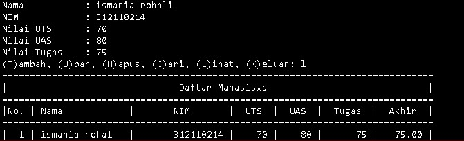
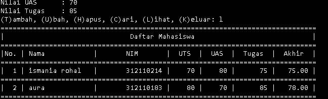

Mengubah data dengan syntax 'u', dan melihat data dengan syntax 'l'

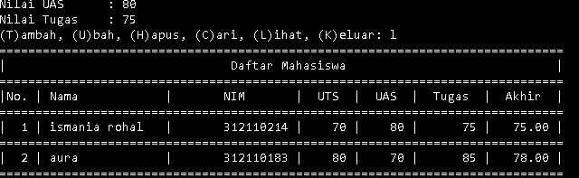

Mencari data dengan syntax 'c', dan melihat data dengan syntax 'l'

Menghapus data dengan syntax 'h' dan melihat data dengan syntax 'l'

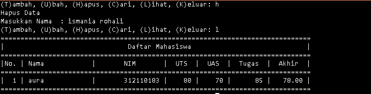

Keluar dari program dengan syntax 'k'

SEKIAN TERIMAKASIH:)